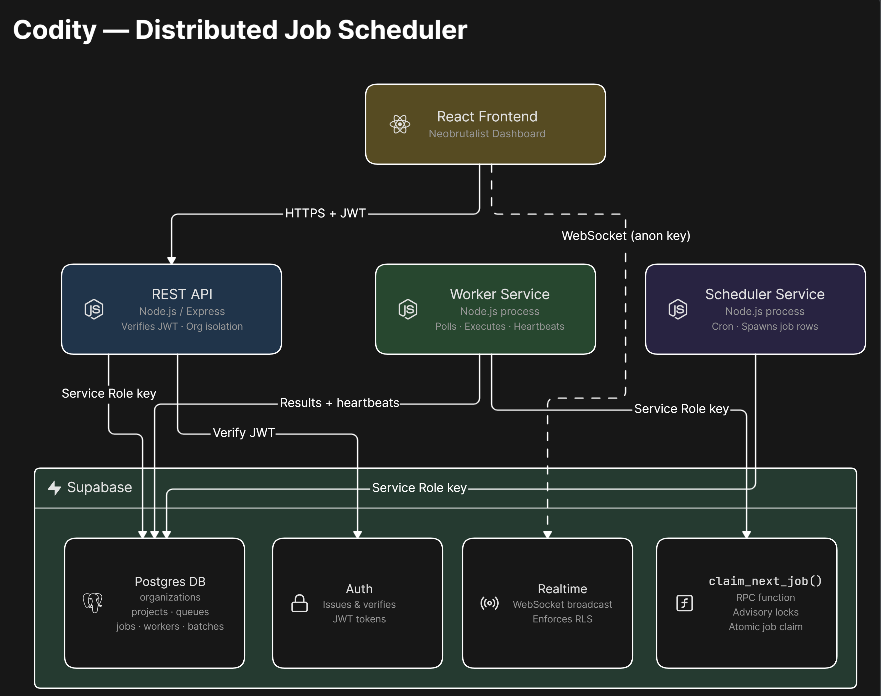
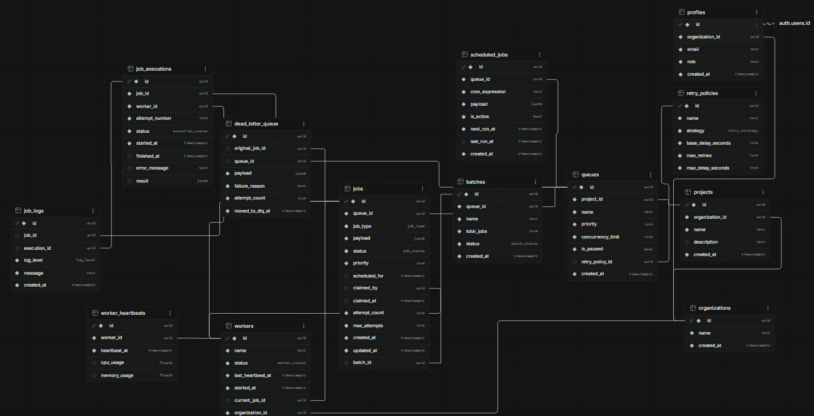
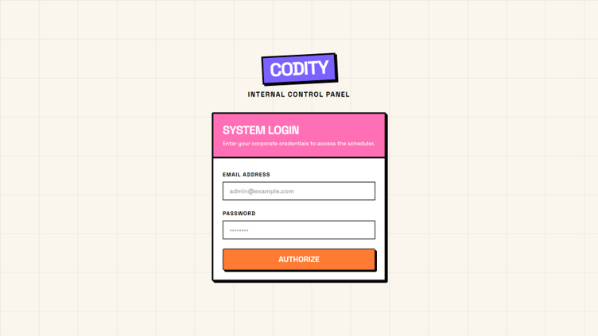
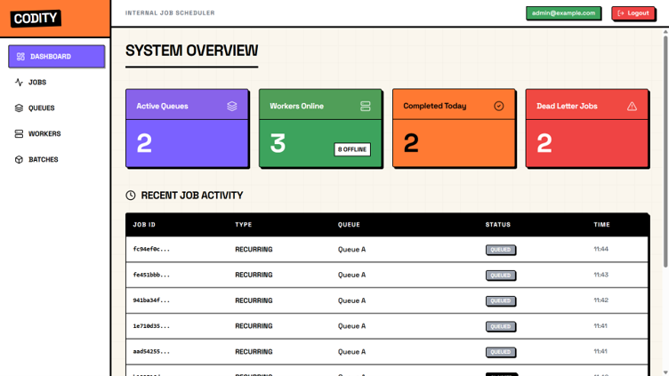
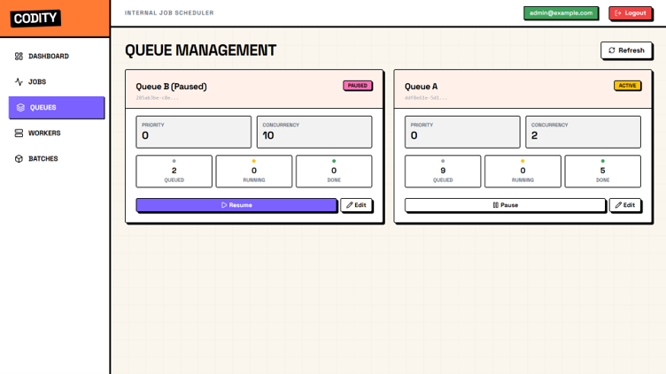
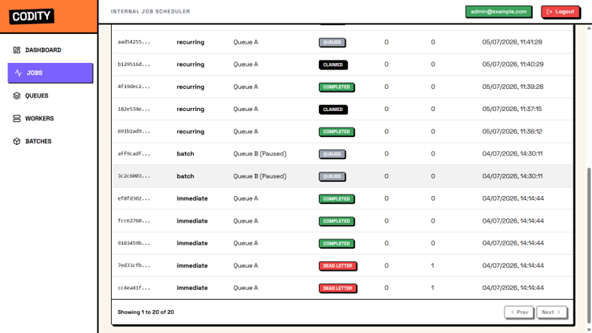
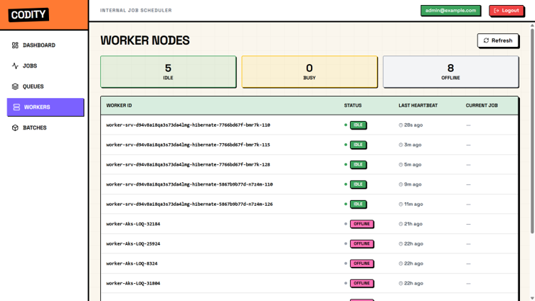
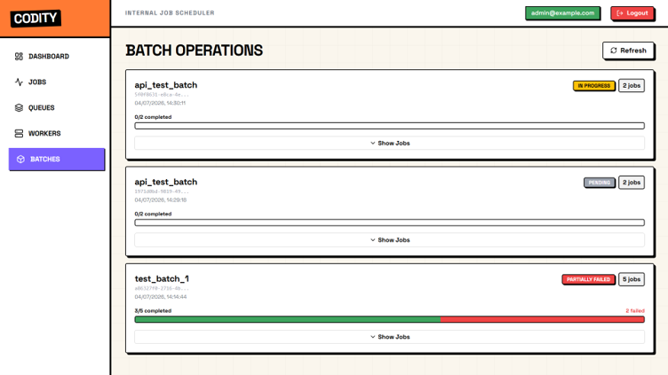

# Codity — Distributed Job Scheduler Platform

A distributed job scheduler with atomic job claiming, retries with backoff, dead letter queues, recurring cron jobs, batch processing, and a live-updating dashboard.

## Live Links

- **Frontend:** [https://codity-ai-xi.vercel.app/](https://codity-ai-xi.vercel.app/)
- **Backend API:** [https://codity-backend-x8tb.onrender.com](https://codity-backend-x8tb.onrender.com)
  *(Note: Render's free tier spins down after 15 minutes of inactivity, so the first request may take 20-30 seconds to wake up the server.)*

## Overview

Codity is a robust, highly-concurrent distributed job scheduler built natively on PostgreSQL. It handles immediate, delayed, and scheduled job executions, providing atomic job claiming via Postgres advisory locks to ensure jobs are never double-processed. The system is split into three independent Node.js backend services (API, Worker, Scheduler) integrated with a live-updating React frontend dashboard, all powered by Supabase (Postgres, Auth, and Realtime).

## Architecture


*The architecture is split into three independent services: an API for mutations and dashboard queries, a Worker pool for continuous job processing and backoff handling, and a standalone Scheduler for injecting recurring cron-based jobs into the main queues.*

## Database Schema


*The database schema contains 13 relational tables carefully designed for high-concurrency queueing and batch processing. Strict Row-Level Security (RLS) is enforced across every table to ensure tenant and role-based data isolation.*

## Screenshots

<table>
  <tr>
    <td align="center"><br/>
    <sub><b>Login</b></sub></td>
    <td align="center"><br/>
    <sub><b>Dashboard Overview</b></sub></td>
  </tr>
  <tr>
    <td align="center"><br/>
    <sub><b>Queue Management</b></sub></td>
    <td align="center"><br/>
    <sub><b>Job Explorer</b></sub></td>
  </tr>
  <tr>
    <td align="center"><br/>
    <sub><b>Worker Nodes</b></sub></td>
    <td align="center"><br/>
    <sub><b>Batch Operations</b></sub></td>
  </tr>
</table>

## Tech Stack

- **Backend:** Node.js, Express
- **Frontend:** React, Vite, TypeScript, Tailwind CSS, shadcn/ui
- **Database / BaaS:** Supabase (Postgres, Auth, Realtime)
- **Testing:** Vitest
- **Design:** Neobrutalism Aesthetic

## Key Features

- **Atomic Job Claiming:** Prevents race conditions using Postgres advisory locks (`pg_try_advisory_xact_lock`).
- **Retry with Configurable Backoff:** Customizable retry policies (linear, exponential, fixed) for transient failures.
- **Dead Letter Queue (DLQ):** Automatically isolates jobs that have exhausted all retry attempts for manual review.
- **Recurring Cron Jobs:** Fully-featured CRON parser to handle scheduled, repeating executions.
- **Batch Processing:** Group multiple interdependent jobs into atomic batches and track aggregated status.
- **Live Dashboard Updates:** UI instantly reflects real-time job and worker statuses using Supabase Realtime channels.
- **Multi-Tenant Isolation:** Complete data separation enforced by Postgres Row-Level Security (RLS) policies.

## Setup Instructions

1. Clone the repository to your local machine.
2. Copy `.env.example` to `.env` in the root directory and fill in your Supabase credentials.
3. Apply the initial schema migrations to your Supabase project:
   ```bash
   supabase db push
   ```
4. Install dependencies for all services:
   ```bash
   npm run install:all
   ```
5. Run the three backend services concurrently (API, Worker, Scheduler) from the root folder:
   ```bash
   npm start
   ```
6. In a separate terminal, start the frontend development server:
   ```bash
   cd frontend
   npm run dev
   ```

## Testing

The system features automated unit and integration testing using Vitest. 

You can run the full automated suite (14 tests) by executing the following command in the root directory:
```bash
npm test
```
*(This triggers `npm test` inside both the `worker/` and `api/` directories.)*

For extensive manual verification procedures—including edge cases, queue isolation, and load handling—please refer to the `TEST_RESULTS.md` document which outlines 9 comprehensive testing scenarios.

## Project Structure

```
├── api/                   # REST API for the frontend dashboard and queue mutations
├── worker/                # Long-running polling workers that execute jobs
├── scheduler/             # Service that processes and injects recurring CRON jobs
├── frontend/              # Neobrutalist React dashboard with Realtime updates
└── supabase/migrations/   # Core PostgreSQL schema, RPCs, and RLS policies
```
